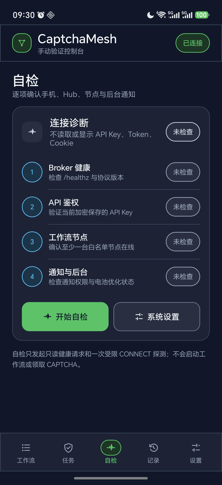

电脑上的 Agent 跑到 CAPTCHA 就停。常见做法是把挑战交给打码平台。CaptchaMesh 换了一条路：浏览器会话留在原电脑，挑战端到端加密之后送到你自己的 Android，人在手机上点完，结果回到原来的任务。

默认模式是本机 Agent API。电脑端跑 `captchamesh start`，只监听 `127.0.0.1:8893`。已经在用 `2captcha-python` 的代码不用改调用方式，换导入或把 API 地址指到这个端口。手机装正式 APK，扫一次码配对。任务到了会走通知，不用先打开「工作流」页。

仓库 README 里有三张实机界面。任务页只显示正在处理的内容，空闲时就是「等待新任务」。自检页逐项看手机、Hub、节点和通知，自称只发健康检查，不会顺手领一个 CAPTCHA。

同一局域网可以用 `--lan` 开私有 HTTPS Hub。手机不在旁边时，可以用电脑端 Tailscale Funnel、Cloudflare Tunnel 或自己的公网 HTTPS 入口；WebUI 和 Agent API 仍然只绑回环。

材料来自公开仓库 [vimalinx/CaptchaMesh](https://github.com/vimalinx/CaptchaMesh) 的 README 和 `docs/images/`。Linux + Python 3.11，手机要 Android 10 以上。

