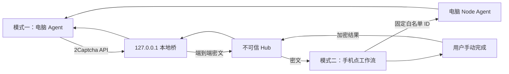

# CaptchaMesh

[](https://github.com/vimalinx/CaptchaMesh/actions/workflows/ci.yml)
[](https://github.com/vimalinx/CaptchaMesh/releases)
[](https://www.python.org/)
[](app-src/)
[](LICENSE)

**电脑 Agent 碰到 CAPTCHA 时，把挑战安全地转给你自己的手机。**

CaptchaMesh 是一个开源的人工接管工具，给个人、低频的使用场景用。电脑端保留原来的浏览器会话，
把挑战端到端加密后交给 Android；你在手机上手动完成，结果回到原任务，Agent 接着跑。

> CaptchaMesh 不做自动识别或绕过 CAPTCHA，也不做任务市场、后台抢单、批量注册和任意远程命令。
> 可选的手机工作流只能启动电脑上预先登记的固定 ID；Hub 发不出命令、路径或临时参数。



## 两种使用方式

| 模式 | 谁先启动 | 是否需要手机点工作流 | 用途 |
|---|---|---:|---|
| **Agent API（默认）** | 电脑 Agent | 否 | 已有 Agent 遇到 CAPTCHA 后自动通知手机 |
| **手机工作流（可选）** | 手机用户 | 是 | 从手机启动电脑预先登记的固定脚本，再等待它提交 CAPTCHA |

默认模式跑一下 `captchamesh start`，扫码配对一次就好。Agent 那边调用
`http://127.0.0.1:8893` 之后，任务会自动到手机上；不用先打开手机的“工作流”页，也不需要活动 run。

只有想“从手机启动电脑脚本”时，才需要配 `registrations.json` 和 `node_agent.py`。脚本里照常写
你自己的业务逻辑；CaptchaMesh 仍然只管启动、状态和人工 CAPTCHA 回传。

## 快速上手：Agent API 模式

### 1. 安装 Android App

从 [Releases](https://github.com/vimalinx/CaptchaMesh/releases) 下载最新 APK，系统要求
Android 10（API 29）以上。首次启动记得允许通知和前台服务权限。
“设置 → 任务提醒”管着两种模式下的 CAPTCHA 到达弹窗；系统声音、震动和通知渠道也从这一页
进 Android 设置改。

从 `0.18.x` 测试版升到 `0.19.0` 要先卸掉旧的 debug 签名 APK，装上正式 APK 后重新扫码配对。
签名只迁移这一次：`0.19.0` 起用固定发布证书，之后直接覆盖安装即可。

### 2. 安装电脑端

电脑端目前只在 Linux 上正式支持，要求 Python 3.11+：

```bash
git clone https://github.com/vimalinx/CaptchaMesh.git
cd CaptchaMesh
./install.sh
captchamesh start
```

`./install.sh` 会把电脑端 CLI 和 `captchamesh-adapter` Agent Skill 一起装好。Skill 默认装在
`${CODEX_HOME:-~/.codex}/skills/captchamesh-adapter`，想确认随时可以看：

```bash
captchamesh skill status
```

装完之后可以这样确认 Skill 文件确实进了 Codex 的全局目录：

```bash
captchamesh skill status
test -f "${CODEX_HOME:-$HOME/.codex}/skills/captchamesh-adapter/SKILL.md" \
  && echo "CaptchaMesh Skill ready"
```

然后开一个新的 Codex 会话，在要接入 CaptchaMesh 的项目目录里输入：

```text
$captchamesh-adapter 检查当前项目的 2captcha-python 接入，使用 Agent API 模式，
把 endpoint 改到本机 CaptchaMesh 并验证，但不要读取或输出真实密钥。
```

Skill 是全局安装的，但只处理当前会话里你明确指定的项目和任务；不会自动上传到 OpenAI
云端，不会绕过项目授权，也不会在后台跑 CAPTCHA 任务。

也可以在任意项目目录里直接跑安装包自带的检查器，项目里不需要有 `.skill/` 目录：

```bash
captchamesh skill inspect . --mode agent-api --json
```

重复跑安装器没问题：没动过的 Skill 会正常更新；一旦发现你自己改过 Skill，或者目标目录
不归 CaptchaMesh 管，它会停下来保留原样，不做静默覆盖。从 wheel 安装的用户可以执行
`captchamesh skill install` 来做这一步。

程序只监听 `127.0.0.1:8893`。在交互终端里打开打印出来的配对地址，用 App 扫码即可。
服务管理器这类非交互环境不会把配对令牌写进日志，而是给出一个权限 `0600` 的本机文件路径。

### 3. 连接 Agent

已经在用 `2captcha-python` 的代码不用改调用方式，换个导入就行：

```python
from captchamesh import TwoCaptcha

solver = TwoCaptcha()
result = solver.turnstile(
    sitekey="PUBLIC_SITE_KEY",
    url="https://example.com/",
)
```

其他 2Captcha v1/v2 客户端把 API 地址改成 `http://127.0.0.1:8893` 就行。
`captchamesh config --json` 默认只返回 API 地址和受限 Key 文件路径，不显示 Key。

配对、连接或任务出错时，可以看脱敏诊断：

```bash
captchamesh logs
captchamesh logs --clear
```

诊断文件在 CaptchaMesh 本机状态目录里，权限 `0600`，上限 256 KiB；只记固定事件、异常类型和
代码位置。异常消息、Key、Token、Cookie、网址、任务内容一概不进。

详细接入方法见 [电脑端本地桥](docs/local-bridge.md) 和
[2Captcha API 兼容说明](docs/twocaptcha-v2-compat.md)。

## 能处理什么

| 类型 | 手机交互 | 说明 |
|---|---|---|
| 图片文字 | 原生输入 | 支持文本、数字和常用约束 |
| 坐标点击 | 原生画布 | 返回一个或多个点击坐标 |
| 图片网格 | 原生网格 | 返回选中的图片序号 |
| 旋转题 | 原生旋钮 | 返回角度 |
| Turnstile / hCaptcha / reCAPTCHA | 挑战组件 | 保留同一任务所需上下文 |
| FunCaptcha / GeeTest | 挑战组件 | 支持对应 v2 任务映射 |
| DataDome | 挑战组件 | 要求匹配的代理和 User-Agent |
| Amazon WAF | 挑战组件 | 支持 `jsapiScript` 或双脚本模式 |

任务的上下文可以带上同一次操作需要的 Cookie、User-Agent、请求头、localStorage 和无鉴权
HTTP(S) 代理。字段定义、结果格式和明确不支持的部分见
[兼容能力矩阵](docs/twocaptcha-v2-compat.md#支持范围)。

## 为什么需要电脑端

CAPTCHA token 通常绑着浏览器状态、网络出口和短期上下文，所以中间要有电脑端桥，它负责：

- 不动 Agent 原来的浏览器和业务流程；
- 任务格式转换和端到端加密都在本机完成；
- 提供常用的 2Captcha API v1/v2 兼容端点；
- 同时接多个 Agent 任务并持久跟踪，手机任务列表里直接点选切换；切回原生图片任务时，已输入的答案、坐标、格子或角度都还在，回传按 `taskId` 隔离；
- 结果只在本机数据库里短期保存，权限 `0600`。

Hub 只转发密文和必要的路由元数据；配对密钥只存在电脑和 Android Keystore 里。

网页挑战共用 Android WebView 的 Cookie 和代理环境，一次只能开一个；处理网页挑战期间，仍可切去看已经打开的原生图片任务。

## 完整测试

先备好 Python 3.11+、JDK 17 和 Android SDK 35，然后运行：

```bash
python3 -m venv .venv
.venv/bin/python -m pip install -r requirements.txt build bandit pip-audit
./tools/test_all.sh
```

如果装了 [Gitleaks](https://github.com/gitleaks/gitleaks)，还可以再跑完整安全门：

```bash
./tools/test_all.sh --security
```

脚本会依次验证 Python 协议与安全回归、发布包边界、安装后的命令行、依赖漏洞、Android
单测/Lint/APK 构建，外加可选的 Git 历史密钥扫描。人工端到端、无线 ADB、通知和 Hub 部署
测试在[完整测试指南](docs/testing.md)。

每次 push 和 pull request，GitHub Actions 也会把 Python 3.11、Python 3.14 和 Android 各测一遍。

## 自己构建 Android App

```bash
cd app-src
./gradlew --no-daemon :app:testDebugUnitTest :app:lintDebug :app:assembleDebug
adb install -r app/build/outputs/apk/debug/app-debug.apk
```

开发时可以走 USB 或无线 ADB：

```bash
adb reverse tcp:8890 tcp:8890
```

日常使用用不上 ADB，推荐电脑端生成的一次性二维码，详见
[Android 安装与连接](docs/phone-deploy.md)。

碰到崩溃、后台断连或任务失败，打开 App 的“记录”页点“复制诊断”。复制出来的只有
版本、异常类型和 CaptchaMesh 自己的栈帧，可以直接贴到私有 Issue；Key、Token、
Cookie、网址和任务内容都不在里面。完整排查步骤见[Android 安装与连接](docs/phone-deploy.md#复制脱敏诊断)。

## 可选：手机工作流模式

```bash
cp registrations.example.json registrations.json
```

在本机 `registrations.json` 里登记固定的 `cwd` 和命令数组；这个文件不进 Git，手机那边也只能
选到登记过的 `id`。`node_agent.py` 跑起来之后，手机“工作流”页可以启动、查看、停止这些脚本。
脚本碰到 CAPTCHA 时，走的还是同一个手机人工验证界面。接入方式见
[两种模式与工作流接入](docs/batch-integration.md)，协议和失败语义在
[工作流节点协议](docs/node-protocol.md)。

## 平台支持

| 组件 | 状态 | 最低环境 |
|---|---|---|
| Android App | 支持 | Android 10 / API 29 |
| Linux 电脑端 | 支持 | Python 3.11+ |
| Linux Hub | 支持 | Ubuntu、systemd、HTTPS 隧道 |
| macOS 电脑端 | 实验性 | Python 3.11+，尚未纳入 CI |
| Windows / WSL | 未验证 | 原生 Windows 暂不支持 |
| iOS | 不支持 | 暂无客户端 |

## 自托管 Hub

Hub 只应该监听 `127.0.0.1`，对外走 HTTPS 反向隧道；别把 8890 直接暴露到公网。
从 [Releases](https://github.com/vimalinx/CaptchaMesh/releases) 下载独立 Hub 包，在 Ubuntu 或
Debian 服务器上跑下面这一条命令，安装器会问你要域名和 Cloudflare Tunnel token：

```bash
sudo ./deploy/hub/install.sh --domain mesh.example.com
```

依赖安装、隔离账户、生成 Key、systemd 服务和 `/healthz` 检查都是它自己来；再跑一遍就是
保留数据的升级。完整步骤、非交互安装和加密备份见 [Hub 部署说明](deploy/hub/README.md)。
公益 Hub 解不了任务正文，但邮箱 ID、方向、时间、密文大小这些路由元数据它看得到。

## 安全与隐私

- 配对能力令牌放在 URL fragment 里，不进 HTTP 请求路径，页面加载完就从地址栏清除。
- 本机状态目录 `0700`，密钥、数据库和非交互配对文件 `0600`。
- 密钥文件拒绝符号链接、硬链接和其他非普通文件。
- 通知、普通日志、脱敏诊断和默认配置输出里没有 Key、Cookie、挑战正文或答案。
- 回调、SOCKS、带认证代理和任意远程命令，默认一律拒绝。
- 发布前 CI 会检查 wheel/sdist，见到本机文件、私有标记或异常归档成员直接判失败。

安全问题请通过 [SECURITY.md](SECURITY.md) 私下报告。CaptchaMesh 只该用在你有权运行的个人
工作流上，并且遵守目标服务的条款和适用法律。

## 文档

| 文档 | 内容 |
|---|---|
| [完整测试指南](docs/testing.md) | 自动、人工、Android、Hub 和发布验收 |
| [电脑端本地桥](docs/local-bridge.md) | 安装、配对、Agent 接入和生命周期 |
| [Android 安装与连接](docs/phone-deploy.md) | APK、通知、二维码和 ADB |
| [端到端加密中继](docs/e2ee-relay.md) | 信任模型、密钥和 Hub 可见信息 |
| [挑战协议 v3](docs/challenge-protocol-v3.md) | 任务字段和类型化结果 |
| [2Captcha 兼容层](docs/twocaptcha-v2-compat.md) | v1/v2 端点与题型矩阵 |
| [两种模式与工作流接入](docs/batch-integration.md) | 默认 Agent API 与可选手机工作流的选择和接入 |
| [工作流节点协议](docs/node-protocol.md) | 本机白名单工作流 |

## 社区与交流

[](https://linux.do/)

有接入经验、兼容性反馈或使用建议，欢迎到 [Linux.do](https://linux.do/) 上聊。
也谢谢 Linux.do 给独立开发者和开源项目提供交流的地方。

## 项目结构

| 路径 | 内容 |
|---|---|
| `app-src/` | Android App 源码 |
| `captchamesh_cli.py` / `local_bridge.py` | 电脑端命令行和本机桥 |
| `broker.py` / `broker_asgi.py` | Hub 与路由 |
| `relay_protocol.py` | 端到端加密信封协议 |
| `challenge_protocol.py` | 挑战与结果协议 |
| `twocaptcha_compat.py` | 2Captcha API v1/v2 翻译层 |
| `node_agent.py` | 可选的白名单工作流节点 |
| `.skill/captchamesh-adapter/` | Agent 接入 Skill |
| `deploy/hub/` | 自托管 Hub 配置 |

想参与的话，[贡献指南](CONTRIBUTING.md)、[社区行为准则](CODE_OF_CONDUCT.md)和
[支持说明](SUPPORT.md)都在这。当前版本 `0.19.8`，[MIT License](LICENSE)。
