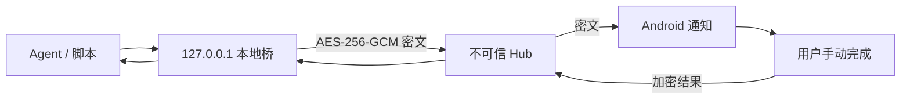

# CaptchaMesh

[](https://github.com/vimalinx/CaptchaMesh/actions/workflows/ci.yml)
[](https://github.com/vimalinx/CaptchaMesh/releases)
[](https://www.python.org/)
[](app-src/)
[](LICENSE)

**让自己的 Agent 在遇到 CAPTCHA 时，把挑战安全地交给自己的手机。**

CaptchaMesh 是一个面向个人、低频工作流的开源人工接管工具。电脑端保留原浏览器会话，
将挑战端到端加密后交给 Android；你在手机上手动完成，结果回到原任务，Agent 继续运行。

> CaptchaMesh 不自动识别或绕过 CAPTCHA，不提供任务市场、后台抢单、批量注册或任意远程命令。
> 手机和 Hub 只能选择电脑预先登记的工作流，不能下发命令、路径或临时参数。



## 三分钟开始

### 1. 安装 Android App

从 [Releases](https://github.com/vimalinx/CaptchaMesh/releases) 下载最新 APK。Android 需要
Android 10（API 29）或更高版本。首次启动时允许通知和前台服务权限。

### 2. 安装电脑端

电脑端当前正式支持 Linux，需要 Python 3.11+：

```bash
git clone https://github.com/vimalinx/CaptchaMesh.git
cd CaptchaMesh
./install.sh
captchamesh start
```

程序只监听 `127.0.0.1:8893`。在交互终端中打开显示的配对地址，然后用 App 扫描二维码。
服务管理器等非交互环境不会把配对令牌写进日志，而是输出一个权限为 `0600` 的本机文件路径。

### 3. 连接 Agent

已经使用 `2captcha-python` 的 Python 程序可以保留调用方式，只替换导入：

```python
from captchamesh import TwoCaptcha

solver = TwoCaptcha()
result = solver.turnstile(
    sitekey="PUBLIC_SITE_KEY",
    url="https://example.com/",
)
```

其他 2Captcha v1/v2 客户端将 API 地址改为 `http://127.0.0.1:8893`。默认的
`captchamesh config --json` 只返回 API 地址和受限 Key 文件路径，不会显示 Key。

详细接入方法见 [电脑端本地桥](docs/local-bridge.md) 和
[2Captcha API 兼容说明](docs/twocaptcha-v2-compat.md)。

## 能处理什么

| 类型 | 手机交互 | 说明 |
|---|---|---|
| 图片文字 | 原生输入 | 支持文本、数字和常用约束 |
| 坐标点击 | 原生画布 | 返回一个或多个点击坐标 |
| 图片网格 | 原生网格 | 返回选中的图片序号 |
| 旋转题 | 原生旋钮 | 返回角度 |
| Turnstile / hCaptcha / reCAPTCHA | 挑战组件 | 保留同一任务所需上下文 |
| FunCaptcha / GeeTest | 挑战组件 | 支持对应 v2 任务映射 |
| DataDome | 挑战组件 | 要求匹配的代理和 User-Agent |
| Amazon WAF | 挑战组件 | 支持 `jsapiScript` 或双脚本模式 |

上下文可以包含同一次任务需要的 Cookie、User-Agent、请求头、localStorage 和无鉴权
HTTP(S) 代理。具体字段、结果格式和明确不支持项见
[兼容能力矩阵](docs/twocaptcha-v2-compat.md#支持范围)。

## 为什么需要电脑端

CAPTCHA token 往往绑定浏览器状态、网络出口和短期上下文。电脑端桥负责：

- 保持 Agent 原来的浏览器与业务流程；
- 在本机完成任务格式转换和端到端加密；
- 提供常用 2Captcha API v1/v2 兼容端点；
- 串行调度单个手机上的人工任务，避免结果串单；
- 只在权限为 `0600` 的本机数据库中短期保存结果。

Hub 只转发密文和必要路由元数据，配对密钥只保存在电脑和 Android Keystore 中。

## 完整测试

准备好 Python 3.11+、JDK 17 和 Android SDK 35 后运行：

```bash
python3 -m venv .venv
.venv/bin/python -m pip install -r requirements.txt build bandit pip-audit
./tools/test_all.sh
```

如果已经安装 [Gitleaks](https://github.com/gitleaks/gitleaks)，可以再运行完整安全门：

```bash
./tools/test_all.sh --security
```

脚本依次验证 Python 协议与安全回归、Python 发布包边界、安装后命令行、依赖漏洞、Android
单测/Lint/APK 构建以及可选的 Git 历史密钥扫描。人工端到端、无线 ADB、通知和 Hub 部署测试见
[完整测试指南](docs/testing.md)。

每次 push 和 pull request 也会在 GitHub Actions 中测试 Python 3.11、Python 3.14 和 Android。

## 自己构建 Android App

```bash
cd app-src
./gradlew --no-daemon :app:testDebugUnitTest :app:lintDebug :app:assembleDebug
adb install -r app/build/outputs/apk/debug/app-debug.apk
```

USB 或无线 ADB 开发模式可使用：

```bash
adb reverse tcp:8890 tcp:8890
```

日常使用不需要 ADB；推荐使用电脑端生成的一次性二维码。详见
[Android 安装与连接](docs/phone-deploy.md)。

## 可选：从手机启动固定工作流

```bash
cp registrations.example.json registrations.json
```

只在本机 `registrations.json` 中登记固定的 `cwd` 和命令数组。该文件不会进入 Git；手机只能
选择登记过的 `id`。协议和失败语义见 [节点协议](docs/node-protocol.md)。

## 平台支持

| 组件 | 状态 | 最低环境 |
|---|---|---|
| Android App | 支持 | Android 10 / API 29 |
| Linux 电脑端 | 支持 | Python 3.11+ |
| Linux Hub | 支持 | Ubuntu、systemd、HTTPS 隧道 |
| macOS 电脑端 | 实验性 | Python 3.11+，尚未纳入 CI |
| Windows / WSL | 未验证 | 原生 Windows 暂不支持 |
| iOS | 不支持 | 暂无客户端 |

## 自托管 Hub

Hub 应只监听 `127.0.0.1`，再通过 HTTPS 反向隧道暴露；不要把 8890 直接开放到公网。
Ubuntu/systemd 模板和上线检查见 [Hub 部署说明](deploy/hub/README.md)。公益 Hub 无法解密任务
正文，但仍能看到邮箱 ID、方向、时间和密文大小等路由元数据。

## 安全与隐私

- 配对能力令牌使用 URL fragment，不进入 HTTP 请求路径，并在页面加载后从地址栏清除。
- 本机状态目录为 `0700`，密钥、数据库和非交互配对文件为 `0600`。
- 密钥文件拒绝符号链接、硬链接和非普通文件。
- 通知、普通日志和默认配置输出不包含 Key、Cookie、挑战正文或答案。
- 回调、SOCKS、带认证代理和任意远程命令默认拒绝。
- CI 在发布前检查 wheel/sdist，发现本机文件、私有标记或异常归档成员会直接失败。

安全问题请按 [SECURITY.md](SECURITY.md) 私下报告。CaptchaMesh 只用于你有权运行的个人工作流，
并遵守目标服务条款和适用法律。

## 文档

| 文档 | 内容 |
|---|---|
| [完整测试指南](docs/testing.md) | 自动、人工、Android、Hub 和发布验收 |
| [电脑端本地桥](docs/local-bridge.md) | 安装、配对、Agent 接入和生命周期 |
| [Android 安装与连接](docs/phone-deploy.md) | APK、通知、二维码和 ADB |
| [端到端加密中继](docs/e2ee-relay.md) | 信任模型、密钥和 Hub 可见信息 |
| [挑战协议 v3](docs/challenge-protocol-v3.md) | 任务字段和类型化结果 |
| [2Captcha 兼容层](docs/twocaptcha-v2-compat.md) | v1/v2 端点与题型矩阵 |
| [节点协议](docs/node-protocol.md) | 本机白名单工作流 |

## 项目结构

| 路径 | 内容 |
|---|---|
| `app-src/` | Android App 源码 |
| `captchamesh_cli.py` / `local_bridge.py` | 电脑端命令行和本机桥 |
| `broker.py` / `broker_asgi.py` | Hub 与路由 |
| `relay_protocol.py` | 端到端加密信封协议 |
| `challenge_protocol.py` | 挑战与结果协议 |
| `twocaptcha_compat.py` | 2Captcha API v1/v2 翻译层 |
| `node_agent.py` | 可选的白名单工作流节点 |
| `.skill/captchamesh-adapter/` | Agent 接入 Skill |
| `deploy/hub/` | 自托管 Hub 配置 |

欢迎阅读 [贡献指南](CONTRIBUTING.md)。当前版本为 `0.18.1`，采用 [MIT License](LICENSE)。
